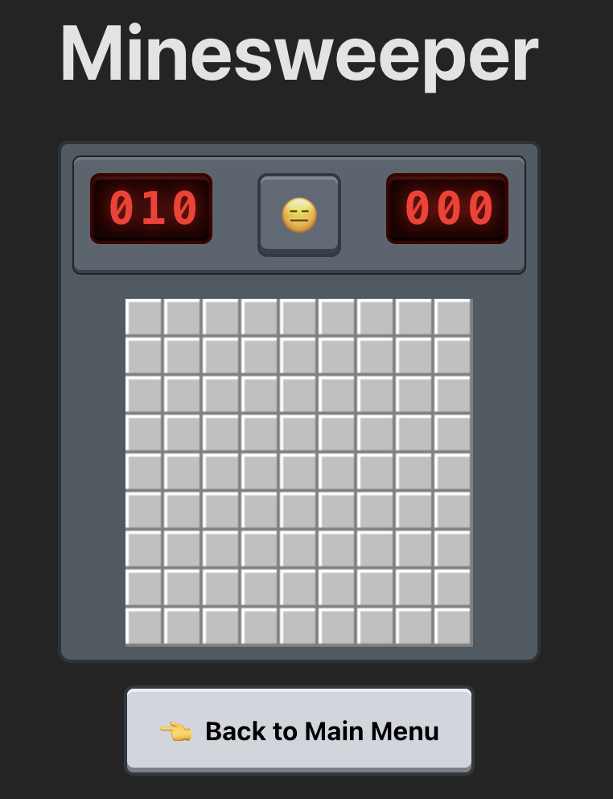
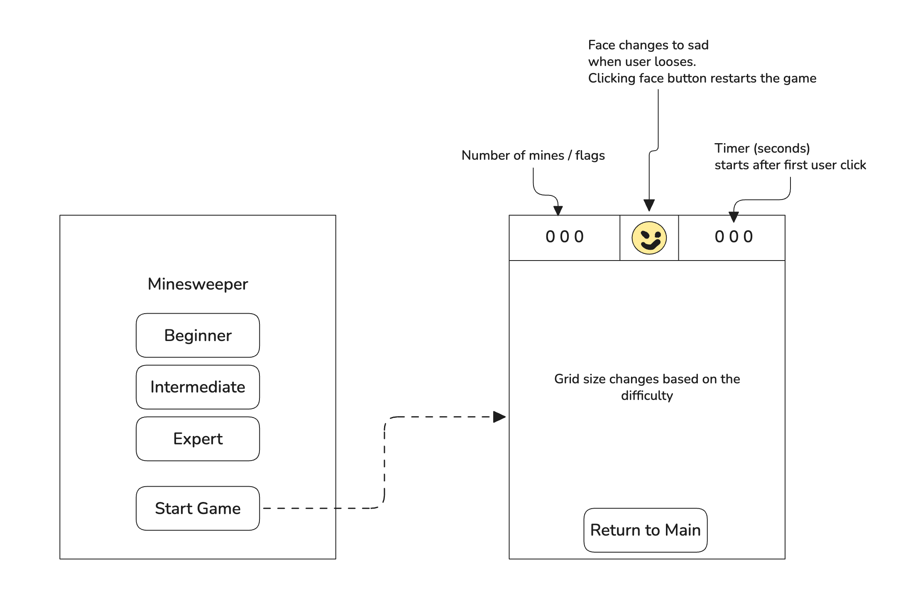
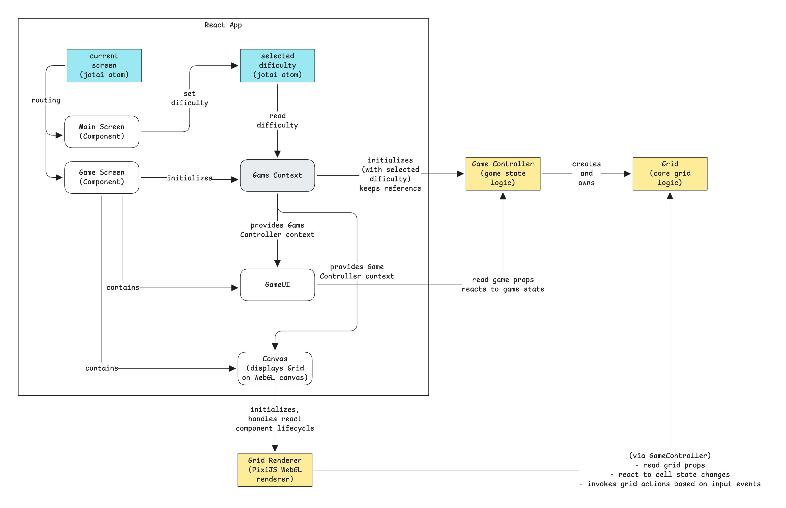
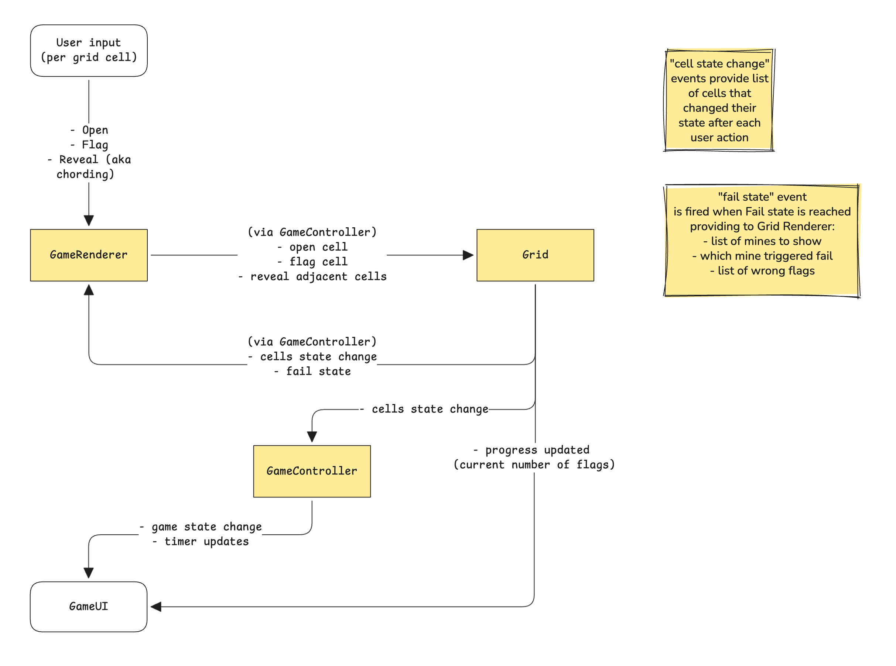

# Minesweeper

A Minesweeper game built with React, Pixi.js and Vite. Deployable to Cloudflare Workers.



## Live Demo

https://minesweeper.nicktgn.dev/

## Development

To run the game locally:

```bash
npm install
npm run dev
```

To deploy to Cloudflare Workers:

```bash
npm run deploy
```

For visual testing/debugging purposes, you can set the `VITE_DEBUG_GRID` environment variable to `true` in `.env` file to show the second grid with all cells open.

## Game Rules & Features

#### Rules:
- The first square the user clicks must never be a mine.
- Clicking a mine ends the game and reveals all mines. Clicking a safe square reveals it; if it has adjacent mines, it displays their count; otherwise, it automatically reveals neighboring squares.
- Right clicking (long press on touch screen) on a square puts a flag on it. The flagged square can’t be opened. Pressing flagged square again removes the flag.
- "Chording": if the number in a square is equal to the number of squares touching that square that are flagged, double clicking on the number opens up all remaining squares around the number.
- The game ends when all safe squares are revealed or when a mine is clicked or "chorded"

#### UI:
- UI displays remaining flags to set and elapsed time (in seconds)
- Smiley button resets the game; face changes based on game state

## Architecture







## TODO:
- [x] Basic game logic
- [x] Basic UI
- [x] Menu screen with difficulty selection
- [x] Deploy to Cloudflare Workers
- [x] Mouse and touch input
- [ ] (Bug) Fix press preview visualization (on mouse down) for single cell and for chording
- [ ] Better test coverage
- [ ] Add CI/CD pipeline
- [ ] Add e2e tests
- [ ] Add custom difficulty levels
- [ ] Add more theming options
- [ ] Use media queries to adjust layout for mobile screens as well as landscape orientation
- [ ] Keep and display stats across sessions
- [ ] Add more polish the UI and create reusable component system
    - [ ] Add storybook
